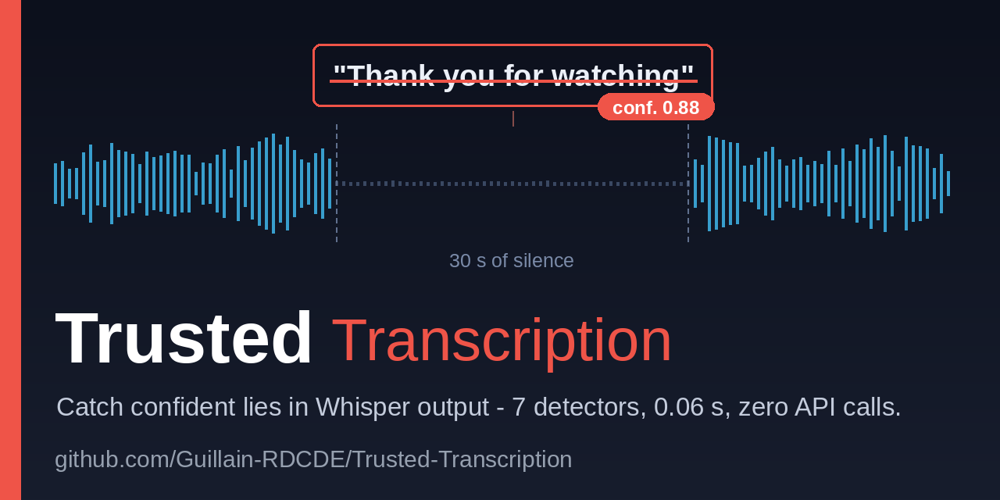

<p align="center">
  
</p>

# Trusted-Transcription

**Catch confident lies in automatic transcription.**

Whisper produces this on 30 seconds of silence:

> *"Thank you for watching. Please subscribe to my channel."*

Confidence: 0.88. No error, no warning. Your downstream system ingests it as fact.

This project catches that — and six other ways ASR pipelines silently produce garbage.

## Try it in 30 seconds (no API key needed)

```bash
git clone https://github.com/Guillain-RDCDE/Trusted-Transcription.git
cd Trusted-Transcription
pip install pydantic click jiwer
PYTHONPATH=src python -m trusted_transcription.cli detect corpus/sample/silence_hallucination.json --format table
```

Output:

```
 SEG  SEVERITY    DETECTOR                   REASON
--------------------------------------------------------------------------------
   2  critical    silence_hallucination      Known phantom phrase: 'Thank you for watching...'
   4  critical    repetition_loop            N-gram 'nous avons constate' repeated 3x in 8 segments
   6  critical    temporal_drift             Timestamp stall: segments 5 and 6 share [55.30-55.30]

Total: 3 flags
```

Three hallucinations caught. Zero API calls. Zero false positives on the clean sample:

```bash
PYTHONPATH=src python -m trusted_transcription.cli detect corpus/sample/clean_transcript.json --format table
# No hallucinations detected.
```

## Better: stop the lies before they exist

Most of those phantom phrases are not the model's fault. They appear on segments
*your pipeline* starved — a few seconds cut at a photo timestamp or a speaker
turn, with no context. Give the model more audio than the segment and keep only
the words that belong to it:

```bash
PYTHONPATH=src python -m trusted_transcription.cli windows corpus/sample/forced_cuts.json
```

Boundaries never move. In production this removed almost all phantom phrases at
once. [ADR 0005](docs/adr/0005-context-window-for-short-segments.md) has the
measurements — and the two variants that looked better and were refused.

## More

**[Reference](docs/REFERENCE.md)** — how it works, the context window, the seven
detectors, the MCP server, cost estimation, the architecture decisions, the
measurement pitfalls, and where this came from.

## License

MIT — **Guillain d'Erceville** — [guillain@poulpe.us](mailto:guillain@poulpe.us) — [GitHub](https://github.com/Guillain-RDCDE) — [LinkedIn](https://www.linkedin.com/in/guillain-d-erceville)
